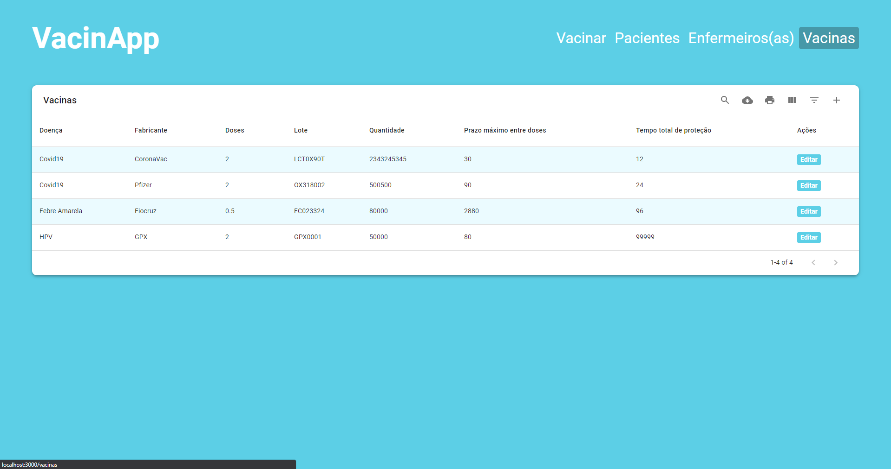

# VacinApp
#### Sua carteirinha de vacinação digital

---
> Integrantes:
> Rodrigo Souza Lins - RA: 819164766
> Nathan Ramos Marrega - RA: 81913620
> Gabriel Lucena dos Santos - RA: 819146592
> Gabriel Santos Carvalho - RA: 819151151
---

## Introdução

O VacinApp é um sistema de vacinação, onde existem duas frentes: a do hospital (**frontend/web**) e a do paciente (**Mobile**).

Nesse sistema, como paciente, o aplicativo funciona como uma carteirinha de vacinação digital, onde o paciente pode consultar suas vacinas, data de retorno para tomar a próxima dose, e registrar as vacinas tomadas quando for ao hospital.

Como enfermeiro, ou funcionário do hospital, a pessoa terá acesso instância web do VacinApp. Onde, poderá registrar as vacinas quando aplicadas, visualizar a lista de pacientes, visualizar a lista de enfermeiros e as vacinas cadastradas no sistema. Caso seja administrador, poderá, além das funções comuns, poderá cadastrar e editar os enfermeiros e as vacinas no sistema.

<figure class="video_container">
  <iframe width="560" height="315" src="https://www.youtube.com/embed/ADUrc15Jfnw" title="YouTube video player" frameborder="0" allow="accelerometer; clipboard-write; encrypted-media; gyroscope; picture-in-picture" allowfullscreen></iframe>
</figure>

---

## Frontend Web

Instância gerenciada pelo hospital e seus enfermeiros/funcionários.
Nela é possível:
 - Visualizar a lista de pacientes cadastrados no sistema;
 - Visualizar a lista de enfermeiros cadastrados no sistema;
 - Visualizar a lista vacinas cadastradas no sistema;
 - Registrar as vacinações feitas pelo hospital;
 - Editar seu próprio perfil de enfermeiro;

Para administradores:
- Cadastrar e editar o perfil de outros enfermeiros;
- Cadastrar e editar as informações das vacinas;

**Nota**: Pacientes só são cadastrados por eles mesmos através do aplicativo.

### Telas

Protótipos feitos no framer: [Protótipos](https://framer.com/projects/93Vhf2T6mIObYAIVk01W-ivSiB)

####1. Login:

####2. Tabela de pacientes:

####3. Tabela de pacientes:

####4. Cadastrar Enfermeiro:

####5. Tabela de vacinas:

####6. Cadastrar Vacina:

####7. Registrar Vacinação:

---

## Mobile

Aplicativo em que o paciente utilizará para ter acesso a sua carteirinha de vacinação digital.
São quatro telas simples, onde o paciente pode:
- Fazer o login
- Fazer seu cadastro
- Consultar as vacinas já tomadas
- Escanear o código QR para confirmar a vacinação

###Telas:

Protótipos feitos no framer: [Protótipos](https://framer.com/projects/VacinApp-Mobile--vBOZh3BqU26id7i0eXUK-8pPR2)

####1. Login:

####2. Cadastro:

####3. Tela de consulta das vacinações (tela principal):

####4. Tela para escanear o código QR:

